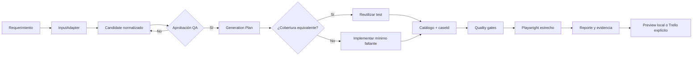
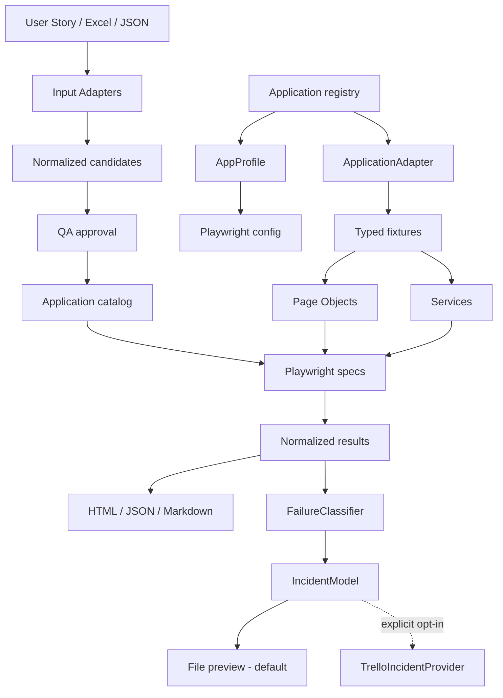

# TestGenerator QA Accelerator

TestGenerator es un acelerador gobernado de automatización QA construido con Playwright y TypeScript. Convierte definiciones funcionales —catálogos, historias de usuario, Excel o JSON— en pruebas trazables, reutilizables y verificables, manteniendo separadas la lógica genérica del framework y la lógica de cada aplicación.

Esta guía permite a una persona nueva entender el proyecto, ejecutar un caso existente, preparar uno nuevo y saber dónde realizar cada cambio.

> Estado actual: el proyecto dispone de perfiles de aplicación, catálogos, Page Objects, fixtures, servicios, pruebas E2E, reportes, evidencia, aprobación QA, reutilización de automatización e incidentes locales. Trello es una integración opcional y explícita; nunca es el comportamiento por defecto.

## Contenido

- [Inicio rápido](#inicio-rápido)
- [Flujo recomendado para cualquier prueba](#flujo-recomendado-para-cualquier-prueba)
- [Arquitectura](#arquitectura)
- [Mapa del repositorio](#mapa-del-repositorio)
- [Ejecutar pruebas existentes](#ejecutar-pruebas-existentes)
- [Crear una prueba desde un requerimiento](#crear-una-prueba-desde-un-requerimiento)
- [Agregar una aplicación](#agregar-una-aplicación)
- [Reportes, evidencia e incidentes](#reportes-evidencia-e-incidentes)
- [Quality gates](#quality-gates)
- [Comandos disponibles](#comandos-disponibles)
- [Diagnóstico de problemas](#diagnóstico-de-problemas)
- [Definición de terminado](#definición-de-terminado)

## Inicio rápido

### Requisitos

- Node.js compatible con las dependencias del proyecto.
- npm.
- PowerShell/Windows para los comandos de esta guía.
- Acceso al sistema objetivo cuando se ejecuten pruebas remotas.

### Instalación

```powershell
npm.cmd install
npx.cmd playwright install chromium
Copy-Item .env.example .env
```

No agregue secretos al repositorio. `.env`, reportes, evidencias y estados de navegador están ignorados por Git.

### Validación inicial

```powershell
npm.cmd run typecheck
npm.cmd run test:unit
npm.cmd run cases:validate
npm.cmd run audit:boundaries
npm.cmd run audit:sanitize
```

### Experiencia guiada

```powershell
npm.cmd run testgenerator
```

Desde este menú puede importar requisitos, revisar candidatos, aprobar un escenario, detectar automatización reutilizable, preparar un handoff, ejecutar una prueba, abrir el último reporte y gestionar evidencia de incidentes.

## Flujo recomendado para cualquier prueba



### Paso 1 — Identificar aplicación y caso

Defina `applicationId` o `APP_PROFILE`, `caseId`, precondiciones, datos, acción, resultado esperado, prioridad, tipo y tags.

El catálogo en `cases/<application-id>/catalog.json` es la fuente de trazabilidad funcional. Un spec no debe existir sin un caso aprobado y reconocible.

### Paso 2 — Normalizar la entrada

Las entradas externas siempre pasan por un `InputAdapter` y producen un preview en `artifacts/input-preview/`.

```powershell
$env:INPUT_APPLICATION_ID='saucedemo'
npm.cmd run import:story -- inputs/user-story/cart-story.md
npm.cmd run import:excel -- inputs/excel/saucedemo-cases.xlsx
npm.cmd run import:json -- inputs/json/saucedemo-cases.json
```

Use solo el adaptador correspondiente. El preview no modifica automáticamente el catálogo de producción.

### Paso 3 — Revisar y aprobar en QA

Una historia de usuario genera candidatos, no casos aprobados. Revise intención, expected result, prioridad y duplicidad antes de aprobar.

```powershell
npm.cmd run candidate:approve -- --app saucedemo --case <CASE_ID>
```

La aprobación conserva el origen y queda en `artifacts/generation/approvals/`.

### Paso 4 — Analizar reutilización antes de generar

```powershell
npm.cmd run generation:plan -- --app saucedemo --case <CASE_ID>
```

Revise componentes reutilizables, tests similares, cobertura equivalente, archivos esperados y gates requeridos. No decida equivalencia solo por palabras parecidas: compare intención, precondiciones, acción, resultado, feature, datos y trazabilidad.

Si un test existente cubre exactamente el criterio, asócielo y reutilícelo; no cree otro spec.

### Paso 5 — Implementar solo lo necesario

- El spec expresa el flujo funcional y las aserciones.
- El Page Object encapsula navegación, locators e interacción UI reutilizable.
- El fixture compone Pages, contexto y servicios.
- El service gestiona API, datos, setup o cleanup no visual.
- El catálogo preserva el `caseId` y el origen.

Reglas obligatorias:

- un caso por vez;
- reutilizar antes de crear;
- usar locators semánticos;
- no usar XPath absoluto, `waitForTimeout` ni espera genérica `networkidle`;
- no debilitar aserciones para obtener PASS;
- no duplicar login, navegación, datos ni componentes.

### Paso 6 — Mantener trazabilidad

Cada test debe mostrar el `caseId` en el título y en una anotación:

```ts
test('@cart [CASE-ID] comportamiento esperado', async ({ pageObject }) => {
  test.info().annotations.push({ type: 'caseId', description: 'CASE-ID' });
  // Given / When / Then
});
```

Cadena esperada:

```text
requerimiento -> candidate -> aprobación QA -> catálogo -> spec -> ejecución -> evidencia -> reporte -> incidente
```

### Paso 7 — Ejecutar gates proporcionales

```powershell
npm.cmd run typecheck
npm.cmd run cases:validate
npm.cmd run audit:boundaries
npm.cmd run audit:sanitize
```

Ejecute `npm.cmd run test:unit` si cambió lógica TypeScript/CJS, normalización, configuración, reportes, incidentes o utilidades.

### Paso 8 — Ejecutar únicamente el caso afectado

```powershell
$env:APP_PROFILE='saucedemo'
$env:PW_WORKERS='1'
$env:HEADLESS='true'
npx.cmd playwright test tests/e2e/saucedemo/<spec>.spec.ts --grep "<CASE_ID>" --workers=1
```

Para verlo en navegador:

```powershell
$env:HEADLESS='false'
npx.cmd playwright test tests/e2e/saucedemo/<spec>.spec.ts --grep "<CASE_ID>" --headed --workers=1
```

### Paso 9 — Revisar resultado y evidencia

- `playwright-report/index.html`: reporte HTML de Playwright.
- `reports/playwright-results.json`: resultado estructurado.
- `artifacts/reports/`: reportes ejecutivos.
- `test-results/`: screenshots, traces y videos según el perfil.
- `artifacts/generation-validation/`: fingerprints de validación post-generación.

Desde `npm.cmd run testgenerator`, **Ver reporte** abre el reporte de la última ejecución válida en el navegador predeterminado.

## Arquitectura

El modelo es:

```text
CORE + APP PROFILE + ADAPTER + CATALOG + POM + FIXTURES + SERVICES
```



### Responsabilidades

- **Core:** `src/core/` contiene contratos independientes de aplicaciones. Nunca importa desde `src/apps/`.
- **AppProfile:** declara URL, roles, capacidades y políticas. `APP_PROFILE` se resuelve en `src/composition/application-registry.ts`.
- **ApplicationAdapter:** conecta el perfil con la implementación técnica de una aplicación.
- **Catálogo:** define casos funcionales independientes de Playwright.
- **Pages:** encapsulan interacción UI reusable y locators.
- **Fixtures:** componen contexto, Pages y servicios con tipos explícitos.
- **Services:** gestionan API, datos, setup, cleanup y sesiones.
- **Specs:** expresan intención funcional y resultados observables.
- **Reporting:** consume resultados normalizados, no objetos internos de Playwright.
- **Incidentes:** separan `FailureClassifier -> IncidentModel -> IncidentProvider`.

## Mapa del repositorio

| Ruta | Responsabilidad |
|---|---|
| `src/core/` | Contratos y capacidades genéricas |
| `src/composition/` | Registro y resolución de aplicaciones |
| `src/apps/<id>/` | Perfil, adapter, Pages, fixtures, services y datos |
| `src/input-adapters/` | Normalización de User Story, Excel y JSON |
| `src/adapters/playwright/` | Frontera Playwright/modelos normalizados |
| `src/integrations/` | Integraciones opt-in, incluido Trello |
| `cases/<id>/` | Catálogo funcional versionado |
| `tests/e2e/<id>/` | Specs Playwright por aplicación |
| `tests/unit/` | Pruebas unitarias |
| `tools/ux/` | CLI interactiva TestGenerator |
| `tools/input/` | Comandos de importación |
| `tools/generation/` | Aprobación, planning, grouping y métricas |
| `tools/demo/` | Flujos de demostración controlados |
| `tools/quality/` | Gates de calidad y seguridad |
| `specs/` | Propuestas, requisitos, diseño, tareas y verificación |
| `artifacts/` | Previews y evidencias generadas; no versionar |

## Ejecutar pruebas existentes

### Listar pruebas

```powershell
$env:APP_PROFILE='saucedemo'
npx.cmd playwright test tests/e2e/saucedemo --list
```

### Ejecutar un spec o `caseId`

```powershell
$env:APP_PROFILE='saucedemo'
npx.cmd playwright test tests/e2e/saucedemo/cart.spec.ts --workers=1
npx.cmd playwright test tests/e2e/saucedemo --grep "SD-CART-001" --workers=1
```

### Seleccionar por estrategia

Primero liste sin ejecutar:

```powershell
npm.cmd run tests:group -- --app saucedemo --feature cart --list-only
npm.cmd run tests:group -- --app saucedemo --suite smoke --list-only
npm.cmd run tests:group -- --app saucedemo --priority high --list-only
```

Quite `--list-only` únicamente cuando confirme los casos mostrados.

## Crear una prueba desde un requerimiento

### Opción recomendada: UX

```powershell
npm.cmd run testgenerator
```

Secuencia:

1. Seleccione Historia de Usuario, Excel o JSON.
2. Seleccione el archivo.
3. Revise los escenarios propuestos.
4. Apruebe solo el escenario correcto.
5. Revise prioridad y estado QA.
6. Solicite la preparación de automatización.
7. Si existe cobertura equivalente, reutilícela y valídela.
8. Si falta comportamiento, prepare el handoff para Codex.
9. Implemente un único caso.
10. Ejecute gates y el caso estrecho.
11. Regrese a TestGenerator: debe mostrar automatización implementada/reutilizada y validación superada.

### Handoff a Codex

Los handoffs se guardan en `artifacts/generation-handoff/`. La UX no imprime las reglas completas; intenta copiar una instrucción concisa al clipboard y, si no puede, muestra la ruta local.

Al implementar un handoff:

- use la skill `playwright-test-implementation`;
- confirme aprobación QA;
- inspeccione cobertura equivalente;
- implemente un solo caso;
- actualice catálogo y trazabilidad;
- ejecute los gates indicados;
- registre validación solo después de PASS.

## Agregar una aplicación

```powershell
npm.cmd run app:scaffold -- --id mi-aplicacion --name "Mi Aplicación" --base-url "https://example.com"
```

Estructura esperada:

```text
src/apps/mi-aplicacion/
  config/
  data/
  fixtures/
  pages/
  services/
cases/mi-aplicacion/
tests/e2e/mi-aplicacion/
```

Luego defina el perfil y adapter, regístrelos, cree los componentes mínimos, catálogo y specs trazados, mantenga la taxonomía en su `TestStrategy` y ejecute gates más un caso estrecho. No agregue lógica específica en `src/core/`.

## Reportes, evidencia e incidentes

### Abrir el reporte

Use **Ver reporte** en TestGenerator. Alternativa manual:

```powershell
npx.cmd playwright show-report
```

### Política de evidencia

Cada perfil controla trace, screenshot y video. No versione `test-results/`, `reports/`, `playwright-report/` ni `artifacts/`.

### Incidentes locales

El default global siempre es:

```text
INCIDENT_MODE=preview
INCIDENT_PROVIDER=file
```

Un fallo simulado se clasifica, se convierte en `IncidentModel` y se guarda localmente. Debe incluir `SIMULATED_DEMO_FAILURE` para no confundirse con un defecto real.

### Trello

Trello solo se activa mediante una decisión explícita en la UX. Configuración local:

```dotenv
TRELLO_API_KEY=
TRELLO_API_TOKEN=
TRELLO_BOARD_NAME=TestGenerator - Demo QA
TRELLO_LIST_NAME=Detected
```

No imprima ni almacene key/token en artifacts. Antes de confirmar éxito, el flujo verifica por API tarjeta, board, lista y marker. Nunca active Trello como provider global por defecto.

## Quality gates

| Comando | Qué valida | Cuándo ejecutarlo |
|---|---|---|
| `npm.cmd run typecheck` | Tipos TypeScript | Todo cambio de código |
| `npm.cmd run test:unit` | Contratos y lógica aislada | Cambios de lógica/configuración |
| `npm.cmd run cases:validate` | Esquema, IDs y trazabilidad | Catálogo o specs |
| `npm.cmd run audit:boundaries` | Core no depende de apps | Arquitectura/composición |
| `npm.cmd run audit:sanitize` | Secretos, paths y anti-patrones POM | Todo cambio relevante |

No ejecute certificaciones completas por defecto. Use controles proporcionales y un caso Playwright estrecho.

## Comandos disponibles

| Comando | Uso |
|---|---|
| `npm.cmd run testgenerator` | UX principal guiada |
| `npm.cmd run test` | Alias de unit tests |
| `npm.cmd run test:unit` | Unit tests |
| `npm.cmd run demo:preflight` | Precondiciones de demo |
| `npm.cmd run demo:list` | Lista casos de referencia |
| `npm.cmd run demo:smoke` | Smoke de referencia |
| `npm.cmd run demo:headed` | Demo visible de referencia |
| `npm.cmd run demo:local` | Demo local determinística |
| `npm.cmd run demo:local:headed` | Demo local visible |
| `npm.cmd run demo:sauce` | Suite SauceDemo controlada |
| `npm.cmd run demo:sauce:headed` | SauceDemo visible |
| `npm.cmd run demo:inputs` | Normaliza inputs de ejemplo |
| `npm.cmd run demo:generation` | Flujo gobernado de generación |
| `npm.cmd run demo:strategy` | Selecciones por estrategia |
| `npm.cmd run report:executive` | Valida reportes ejecutivos |
| `npm.cmd run trello:setup` | Descubre board/list sin mostrar secretos |
| `npm.cmd run trello:test` | Crea una tarjeta; solo con autorización |

`demo:full`, suites completas y comandos que crean tarjetas reales requieren intención explícita: pueden consumir tiempo o producir efectos persistentes.

## Diagnóstico de problemas

### Falta `APP_PROFILE`

```powershell
$env:APP_PROFILE='saucedemo'
```

Use un perfil registrado en `src/composition/application-registry.ts`.

### Playwright no encuentra Chromium

```powershell
npx.cmd playwright install chromium
```

### `ERR_NETWORK_ACCESS_DENIED`, timeout o DNS

Compruebe conexión, proxy/VPN, firewall y disponibilidad. No cambie aserciones ni agregue esperas arbitrarias para ocultar un problema de entorno.

### El caso no aparece como ejecutable

Verifique aprobación QA, catálogo con `automationStatus: automated`, `caseId` exacto en título/anotación, fingerprint vigente y gates más ejecución estrecha en PASS.

### El reporte no abre

Confirme que `playwright-report/index.html` corresponde a la última ejecución y use `npx.cmd playwright show-report` como fallback.

### Trello no registra

Verifique las cuatro variables `TRELLO_*`, nombres exactos de board/list y la selección explícita **Registrar incidencia en Trello**. Ante error, la evidencia local debe conservarse y la UX no debe afirmar que la tarjeta fue creada.

### Un test es flaky

Revise locators, estado inicial, datos, dependencias y esperas observables. No use retries, `waitForTimeout` ni aserciones débiles para esconder inestabilidad.

## Definición de terminado

Un caso está terminado cuando:

- el requerimiento no es ambiguo y existe aprobación QA;
- catálogo, origen y `caseId` son trazables;
- se descartó duplicación por equivalencia funcional;
- se reutilizaron Pages, fixtures, services y datos;
- la interacción reusable vive en POM;
- el spec conserva intención y aserciones fuertes;
- los gates aplicables están en PASS;
- el caso estrecho está en PASS;
- reporte y evidencia pertenecen a la ejecución actual;
- TestGenerator muestra automatización implementada/reutilizada y validación superada;
- no se expusieron secretos ni se activaron integraciones externas sin autorización.

## Gobierno y documentación adicional

- [`AGENTS.md`](AGENTS.md): contrato permanente de ingeniería.
- [`specs/README.md`](specs/README.md): proceso Spec-Driven Development.
- [`docs/DEMO.md`](docs/DEMO.md): flujo de demostración.
- [`docs/DEMO-SCRIPT.md`](docs/DEMO-SCRIPT.md): guion operativo.
- [`NOTICE.md`](NOTICE.md): uso y distribución.

Los cambios arquitectónicos o sustanciales deben seguir:

```text
EXPLORE -> PROPOSAL -> APPROVAL -> REQUIREMENTS -> DESIGN -> TASKS -> IMPLEMENT -> VERIFY
```

Para una corrección pequeña, mantenga el cambio acotado, respete el contrato y ejecute únicamente los gates relevantes.
