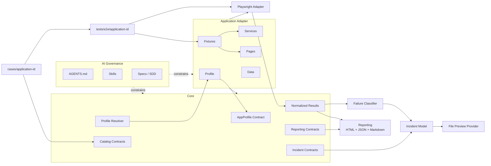

# TestGenerator Core Architecture Design

## System model



The critical dependency rule is: **`src/core` never imports `src/apps`.** Application adapters may depend on core contracts. Reporting and Incident Management do not depend on each other; both consume normalized models through their own contracts.

## Responsibilities

### Core

Defines stable application-independent contracts and orchestration for profiles, catalogs, normalized results, evidence, reporting, incidents, and validation. It contains no selectors, application routes, credentials, roles with application meaning, or business workflows.

### AppProfile

Provides validated declarative configuration through `id`, `displayName`, `baseURL`, optional `apiURL`, `roles`, `testMatch`, `capabilities`, `featureFlags`, `evidencePolicy`, and `incidentPolicy`. It is not a service locator and contains no technical implementation or business workflow.

Safe defaults support applications without an API, multiple roles, reusable authentication, or external incident provider:

- `apiURL` may be absent;
- `roles` defaults to one non-authenticated role when the adapter needs no role variation;
- capabilities default to disabled;
- reusable authentication is opt-in;
- evidence retention is conservative and generated paths remain ignored;
- incident policy defaults to `preview` with provider `file`.

Capabilities are declarative data, initially `authentication`, `apiDataSetup`, `fileUpload`, `fileDownload`, `multiRole`, `networkInterception`, and `incidentReporting`. New capability keys may be added through a backward-compatible optional extension without creating handlers, class hierarchies, or repeated changes to unrelated core contracts.

### Application Adapter

Owns one application's technical implementation and composition. It connects the profile, Pages, fixtures, services, and test data to core contracts while catalogs and tests remain external versioned inputs associated by application ID.

```text
src/apps/<application-id>/
  config/
  pages/
  fixtures/
  services/
  data/

cases/<application-id>/
tests/e2e/<application-id>/
```

A future `npm run app:scaffold` creates these paths without modifying `src/core`.

### Catalog

Stores Playwright-independent functional cases with `caseId`, `title`, `description`, `preconditions`, `inputData`, `steps`, `expectedResults`, `priority`, `type`, `tags`, and `automationStatus`. It preserves `caseId -> Playwright spec -> execution -> evidence -> report -> incident` traceability.

### Pages

Encapsulate reusable UI interaction and semantic locators. Pages avoid complex functional assertions and do not own API data preparation or cleanup.

### Fixtures

Provide small typed composition units for browser context, configured roles, Pages, services, and reusable setup. They must not become hidden end-to-end workflows.

### Services

Own API operations, synthetic data preparation, cleanup, and other non-UI application behavior. They do not contain browser selectors.

### Tests

Express catalog intent, business steps, and observable outcomes. Tests remain independent and delegate reusable UI and non-UI mechanics to the correct adapter components.

### Reporting

Consumes `NormalizedTestResult` and evidence metadata. A boundary adapter converts Playwright results without exposing Playwright internal objects to the rest of core. Initial outputs are Playwright HTML, executive JSON, and executive Markdown. Reporting does not import application adapters or incident providers, infer behavior from application paths, or abstract other automation frameworks.

### Incidents

Separates `FailureClassifier -> IncidentModel -> IncidentProvider`. The classifier supports `PRODUCT_DEFECT`, `AUTOMATION_DEFECT`, `TEST_DATA`, `ENVIRONMENT`, and `UNKNOWN`; failure alone never implies a product defect. Defaults are `INCIDENT_MODE=preview` and `INCIDENT_PROVIDER=file`. Jira, Azure DevOps, and Trello are future opt-in adapters, not MVP runtime dependencies.

### AI Governance

`AGENTS.md` supplies permanent rules, specs capture approved change intent, and skills provide specialized procedures. None may silently redefine catalog expectations to make an implementation pass.

## Boundaries and composition

- Application selection uses only a minimal static resolver: `APP_PROFILE -> registry/map -> AppProfile + ApplicationAdapter`. An absent or unknown ID fails explicitly.
- Core consumes interfaces or validated data supplied by the selected adapter.
- An application directory may import core contracts; the reverse dependency is forbidden.
- Catalog validation happens before catalog data reaches execution or reporting.
- Reporting receives normalized results rather than Playwright- or application-specific objects.
- Incident preview independently consumes normalized failures and evidence references; real provider side effects are not part of the default design.
- Fixtures compose context and dependencies but do not accumulate functional workflows.
- Specs express functional intent. Reusable interactions and complex selectors follow POM; a justified trivial locator may remain in a spec.

## Security boundaries

- Secrets and private endpoints are never versioned.
- Storage state is ephemeral and written only to ignored paths.
- Test data is synthetic when practical.
- Evidence is potentially sensitive, uses safe ignored paths, is sanitized before summaries or incidents, and follows an explicit retention policy.
- External providers require deliberate opt-in configuration; preview plus file remains the safe default.

## MVP exclusions

The MVP does not introduce a dependency-injection framework, event bus, generic plugin framework, microservices, database, administrative UI, SaaS platform, Selenium/Cypress abstraction, mobile automation, or autonomous self-healing. The profile resolver is a static map without reflection or dynamic package discovery.

This document defines the target only. No TypeScript structure is implemented by this spec phase.
